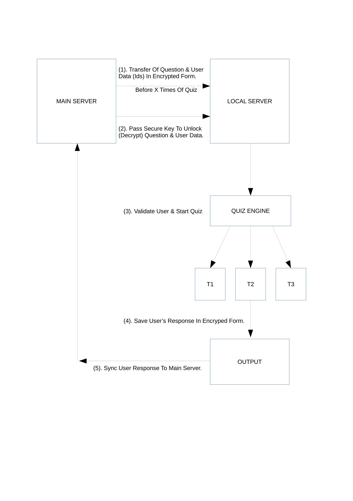

# Savsoft Quiz Micro
Micro script to conduct offline exam with central control online administration.

Important definition: 
1) Quiz , Exam, test all are same terms.
2) Candidates are the users who are taking quiz or exam.

After 8 years success of Savsoft Quiz application, we developed a light weight php script to conduct secure offline computer based exams.

What is difference between Savsoft Quiz and Savsoft Quiz Micro?
Savsoft Quiz is the open source web application to manage online examination. It has all basic features like create question banks, create quiz, generate reports and many more eLearning features. 
You can try online demo or download it at http://savsoftquiz.org  
It also have enterprise version with more features, plugins and android app which is available at https://savsoftquiz.com 

<b>Now what is Savsoft Quiz Micro and how it different from Savsoft Quiz?</b>

Savsoft Quiz Micro is compressed or tiny version (Less than 1 MB)  of Savsoft Quiz and only focus to conduct computer based quiz or exam on local network (intranet) instead of public internet.
It doesn't support features like question banks, post quiz reports or other eLearning features.

<b>Where Savsoft Quiz Micro is useful?</b>

If you are recruitement agency or private or Government organization/Department and wants to organize/conduct an exam on perticular date/time.
You can host exam with the help of Savsoft Quiz Micro. 

Basically it is devided into two web application.

<b>1) Main Server</b>

<b>2) Local Server</b>

Main Server is the administration level application to generate encrypted files of candidate login info (users who is taking quiz) and questions. These files are encrypted with the help of encryption key.
  This application can be installed on local or public server (depends upon requirements, Usually on public server). Once encrypted files are generated, these can be shared with examination centre (where quiz or exam going to host) 
 Examination centre has installed local server application on intranet (local network only, no public internet). Invigilator in examination centre will upload encrypted files (received from main server admin) into local server. 
 On the time of exam (or sometime before exam) main administrator will share encryption key with examination centre(S) so encrypted files can be read by local server to start exam.
Candidates in the examination centre can access the local server app into their assigned system (PC). (Open local server app path in browser like http://192.168.1.2/local_server/ )
Now candidates can login with their user id and password and start exam. All the responses saved by candidates will store in encrypted form into text files.
After the closing of exam invigilator will enclose all the response files into zip format and send to Main server (or Administrator).
Administrator will upload that zip file into main server app to generate results.

Here are the process flow diagram.

<b>System Requirements:</b>
1) Apache
2) PHP 5.6+ 
3) PHP Zip library
No Mysql or Database required

<b>Installation:</b>
1) Upload folder main_server and local_server to public server (or hosting) and local server (on intranet) respectively.
2) Change writeable permission to following folders:
   local_server/input/
   local_server/output/
   local_server/logs/
   main_server/output/
   main_server/response/
   main_server/upload/
3) Both local_server and main_Server has config.php file where you can update various parameters.
examination centre have to update config.php file with encrypted files name and encryption key to start exam.
4) Main admin default logins are:
Username: admin
Password: admin

<b>To raise any issue visit: <a href="https://github.com/savsoft10/Savsoft-Quiz-Micro/issues">https://github.com/savsoft10/Savsoft-Quiz-Micro/issues</a>
 
For professional support and customization, you can contact us at <a href="http://micro.savsoftquiz.org/">http://micro.savsoftquiz.org/</a>	 
</b>

